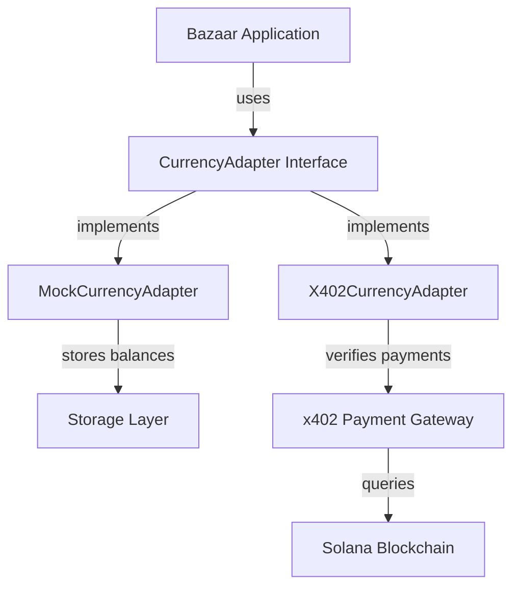

# Design Document

## Overview

This design document describes the architecture for integrating currency flow into the bazaar-x402 marketplace. The system provides a dual-mode currency system: mock mode for development/testing and production mode using the x402 payment protocol with Solana USDC. The design emphasizes clean abstraction, testability, and seamless switching between modes.

### Key Design Principles

1. **Adapter Pattern**: Currency operations abstracted behind a common interface
2. **Mode Agnostic**: Application code works identically in mock and production modes
3. **Type Safety**: Full TypeScript typing for all currency operations
4. **Testability**: Mock mode enables rapid development without blockchain dependency
5. **Security First**: Payment verification follows x402 protocol security requirements
6. **Network Flexibility**: Support for both Solana devnet and mainnet

## Architecture

### High-Level Architecture

```
┌─────────────────────────────────────────────────────────────┐
│                    Bazaar Application                        │
│  (Mystery Boxes, Listings, Marketplace Logic)               │
└────────────────────┬────────────────────────────────────────┘
                     │
                     │ Uses CurrencyAdapter Interface
                     │
        ┌────────────┴────────────┐
        │                         │
┌───────▼────────┐      ┌────────▼──────────┐
│ MockCurrency   │      │ X402Currency      │
│ Adapter        │      │ Adapter           │
└───────┬────────┘      └────────┬──────────┘
        │                        │
        │                        │
┌───────▼────────┐      ┌────────▼──────────┐
│ In-Memory or   │      │ x402 Payment      │
│ Redis Storage  │      │ Gateway           │
└────────────────┘      └────────┬──────────┘
                                 │
                        ┌────────▼──────────┐
                        │ Solana Blockchain │
                        │ (Devnet/Mainnet)  │
                        └───────────────────┘
```

### Component Diagram




## Components and Interfaces

### 1. CurrencyAdapter Interface

The core abstraction that defines all currency operations.

```typescript
interface CurrencyAdapter {
  /**
   * Get user's current currency balance
   */
  getBalance(userId: string): Promise<CurrencyBalance>;
  
  /**
   * Deduct currency from user's balance
   * Throws error if insufficient balance
   */
  deduct(userId: string, amount: number): Promise<DeductionResult>;
  
  /**
   * Add currency to user's balance
   * Used for mock mode testing and seller payments
   */
  add(userId: string, amount: number): Promise<AdditionResult>;
  
  /**
   * Initiate a purchase (returns 402 or processes payment)
   */
  initiatePurchase(params: PurchaseParams): Promise<PurchaseInitiation>;
  
  /**
   * Verify and complete a payment
   */
  verifyPurchase(params: VerifyParams): Promise<PurchaseResult>;
  
  /**
   * Get transaction history for user
   */
  getTransactions(userId: string, options?: PaginationOptions): Promise<Transaction[]>;
}
```

### 2. MockCurrencyAdapter

Implementation for development and testing without blockchain.

**Storage Strategy:**
- In-memory Map for simple testing
- Redis for persistent mock mode (optional)
- Configurable starting balance per user

**Key Features:**
- Instant balance updates
- No network latency
- Deterministic transaction IDs
- Full transaction logging

**Implementation Details:**
```typescript
class MockCurrencyAdapter implements CurrencyAdapter {
  private balances: Map<string, number> | RedisClient;
  private transactions: Map<string, Transaction[]>;
  private config: MockCurrencyConfig;
  
  constructor(config: MockCurrencyConfig) {
    this.config = config;
    this.balances = config.useRedis 
      ? new RedisClient(config.redisUrl)
      : new Map();
    this.transactions = new Map();
  }
  
  async getBalance(userId: string): Promise<CurrencyBalance> {
    let balance = await this.balances.get(userId);
    if (balance === undefined) {
      balance = this.config.defaultBalance;
      await this.balances.set(userId, balance);
    }
    return { amount: balance, currency: 'MOCK_USDC' };
  }
  
  async deduct(userId: string, amount: number): Promise<DeductionResult> {
    const current = await this.getBalance(userId);
    if (current.amount < amount) {
      throw new InsufficientBalanceError(current.amount, amount);
    }
    const newBalance = current.amount - amount;
    await this.balances.set(userId, newBalance);
    return { success: true, newBalance, txId: this.generateMockTxId() };
  }
  
  // ... other methods
}
```


### 3. X402CurrencyAdapter

Implementation for production using x402 payment protocol.

**Integration Points:**
- Solana Web3.js for blockchain queries
- x402 facilitator for payment verification
- Network-specific USDC mint addresses
- RPC endpoint management

**Payment Flow:**
1. Client requests purchase → Return 402 with payment requirements
2. Client signs transaction with wallet → Broadcasts to Solana
3. Client retries with X-Payment header containing signature
4. Server verifies transaction on-chain
5. Server completes purchase and returns success

**Implementation Details:**
```typescript
class X402CurrencyAdapter implements CurrencyAdapter {
  private connection: Connection;
  private config: X402Config;
  private facilitator: X402Facilitator;
  
  constructor(config: X402Config) {
    this.config = config;
    this.connection = new Connection(
      config.network === 'mainnet' 
        ? config.mainnetRpcUrl 
        : config.devnetRpcUrl
    );
    this.facilitator = new X402Facilitator(this.connection);
  }
  
  async getBalance(userId: string): Promise<CurrencyBalance> {
    // Query on-chain USDC balance
    const publicKey = new PublicKey(userId);
    const tokenAccounts = await this.connection.getParsedTokenAccountsByOwner(
      publicKey,
      { mint: new PublicKey(this.getUsdcMint()) }
    );
    
    const balance = tokenAccounts.value[0]?.account.data.parsed.info.tokenAmount.uiAmount || 0;
    return { amount: balance, currency: 'USDC' };
  }
  
  async initiatePurchase(params: PurchaseParams): Promise<PurchaseInitiation> {
    // Return 402 Payment Required
    const paymentRequirements = this.createPaymentRequirements(params);
    return {
      status: 402,
      paymentRequired: true,
      requirements: paymentRequirements,
    };
  }
  
  async verifyPurchase(params: VerifyParams): Promise<PurchaseResult> {
    // Decode X-Payment header
    const paymentPayload = this.decodePaymentHeader(params.paymentHeader);
    
    // Verify with facilitator
    const verification = await this.facilitator.verifyPayment({
      paymentHeader: params.paymentHeader,
      expectedAmount: params.expectedAmount,
      expectedRecipient: params.expectedRecipient,
      network: this.config.network,
    });
    
    if (!verification.success) {
      throw new PaymentVerificationError(verification.error);
    }
    
    return {
      success: true,
      txHash: verification.txHash,
      networkId: verification.networkId,
    };
  }
  
  private getUsdcMint(): string {
    return this.config.network === 'mainnet'
      ? this.config.usdcMintMainnet
      : this.config.usdcMintDevnet;
  }
  
  // ... other methods
}
```


### 4. X402 Facilitator

Handles x402 protocol payment verification and settlement.

**Responsibilities:**
- Decode payment headers
- Verify transaction signatures
- Query Solana blockchain
- Validate payment amounts and recipients
- Handle transaction polling with retries

**Implementation:**
```typescript
class X402Facilitator {
  private connection: Connection;
  private config: FacilitatorConfig;
  
  async verifyPayment(params: VerifyPaymentParams): Promise<VerificationResult> {
    // Decode payment payload
    const payload = this.decodePaymentHeader(params.paymentHeader);
    
    // Validate payload structure
    if (!this.validatePayload(payload)) {
      return { success: false, error: 'Invalid payment payload' };
    }
    
    // Verify network matches
    if (payload.network !== params.network) {
      return { success: false, error: 'Network mismatch' };
    }
    
    // Verify amount
    const expectedAmount = BigInt(Math.floor(params.expectedAmount * 1_000_000));
    const actualAmount = BigInt(payload.payload.amount);
    if (actualAmount < expectedAmount) {
      return { success: false, error: 'Insufficient amount' };
    }
    
    // Verify recipient
    if (payload.payload.to.toLowerCase() !== params.expectedRecipient.toLowerCase()) {
      return { success: false, error: 'Recipient mismatch' };
    }
    
    // Verify on-chain
    const isValid = await this.verifyTransactionOnChain(
      payload.payload.signature,
      payload.payload.from,
      payload.payload.to,
      payload.payload.amount,
      payload.payload.mint
    );
    
    if (!isValid) {
      return { success: false, error: 'Transaction not found on blockchain' };
    }
    
    return {
      success: true,
      txHash: payload.payload.signature,
      networkId: params.network,
    };
  }
  
  private async verifyTransactionOnChain(
    signature: string,
    from: string,
    to: string,
    amount: string,
    mint: string
  ): Promise<boolean> {
    // Poll for transaction with retries
    for (let i = 0; i < this.config.maxPollAttempts; i++) {
      try {
        const tx = await this.connection.getTransaction(signature, {
          commitment: 'confirmed',
          maxSupportedTransactionVersion: 0,
        });
        
        if (tx && tx.meta && !tx.meta.err) {
          // Transaction exists and succeeded
          return true;
        }
        
        // Wait before retry
        if (i < this.config.maxPollAttempts - 1) {
          await this.sleep(this.config.pollIntervalMs);
        }
      } catch (err) {
        // Transaction not found yet, continue polling
        if (i < this.config.maxPollAttempts - 1) {
          await this.sleep(this.config.pollIntervalMs);
        }
      }
    }
    
    return false;
  }
  
  private sleep(ms: number): Promise<void> {
    return new Promise(resolve => setTimeout(resolve, ms));
  }
}
```


### 5. Marketplace Integration

How currency adapters integrate with existing marketplace components.

**Mystery Box Purchase:**
```typescript
class MysteryBoxManager {
  constructor(
    private storage: StorageAdapter,
    private itemAdapter: ItemAdapter,
    private currencyAdapter: CurrencyAdapter
  ) {}
  
  async purchaseMysteryBox(userId: string, boxId: string): Promise<PurchaseResult> {
    const box = await this.storage.getMysteryBox(boxId);
    if (!box) throw new NotFoundError('Mystery box not found');
    
    // Check balance
    const balance = await this.currencyAdapter.getBalance(userId);
    if (balance.amount < box.priceUSDC) {
      throw new InsufficientBalanceError(balance.amount, box.priceUSDC);
    }
    
    // Deduct currency
    const deduction = await this.currencyAdapter.deduct(userId, box.priceUSDC);
    
    try {
      // Generate items
      const items = await this.generateBoxContents(box);
      
      // Add to inventory
      await this.storage.addItemsToInventory(userId, items);
      
      // Record transaction
      await this.storage.createTransaction({
        userId,
        type: 'mystery_box_purchase',
        amount: box.priceUSDC,
        boxId,
        items: items.map(i => i.id),
        txId: deduction.txId,
        timestamp: Date.now(),
      });
      
      return {
        success: true,
        items,
        txId: deduction.txId,
        newBalance: deduction.newBalance,
      };
    } catch (error) {
      // Rollback on failure
      await this.currencyAdapter.add(userId, box.priceUSDC);
      throw error;
    }
  }
}
```

**Listing Purchase:**
```typescript
class ListingManager {
  constructor(
    private storage: StorageAdapter,
    private itemAdapter: ItemAdapter,
    private currencyAdapter: CurrencyAdapter
  ) {}
  
  async purchaseListing(buyerId: string, listingId: string, paymentHeader?: string): Promise<PurchaseResult> {
    const listing = await this.storage.getListing(listingId);
    if (!listing) throw new NotFoundError('Listing not found');
    if (listing.status !== 'active') throw new Error('Listing not available');
    
    // If no payment header, initiate purchase (may return 402)
    if (!paymentHeader) {
      return await this.currencyAdapter.initiatePurchase({
        buyerId,
        sellerId: listing.sellerId,
        amount: listing.priceUSDC,
        resource: `/api/listings/${listingId}`,
        description: listing.title,
      });
    }
    
    // Verify payment
    const verification = await this.currencyAdapter.verifyPurchase({
      paymentHeader,
      expectedAmount: listing.priceUSDC,
      expectedRecipient: listing.sellerId,
    });
    
    if (!verification.success) {
      throw new PaymentVerificationError(verification.error);
    }
    
    // Transfer item
    await this.storage.transferItem(listing.itemId, listing.sellerId, buyerId);
    
    // Mark listing as sold
    await this.storage.updateListing(listingId, { status: 'sold' });
    
    // Record transactions
    await this.storage.createTransaction({
      userId: buyerId,
      type: 'listing_purchase',
      amount: listing.priceUSDC,
      listingId,
      itemId: listing.itemId,
      txId: verification.txHash,
      timestamp: Date.now(),
    });
    
    await this.storage.createTransaction({
      userId: listing.sellerId,
      type: 'listing_sale',
      amount: listing.priceUSDC,
      listingId,
      itemId: listing.itemId,
      txId: verification.txHash,
      timestamp: Date.now(),
    });
    
    return {
      success: true,
      txHash: verification.txHash,
      networkId: verification.networkId,
    };
  }
}
```


## Data Models

### Currency Balance

```typescript
interface CurrencyBalance {
  amount: number;        // Amount in USDC (with decimals)
  currency: string;      // 'USDC' or 'MOCK_USDC'
  lastUpdated?: number;  // Timestamp of last update
}
```

### Transaction Record

```typescript
interface Transaction {
  id: string;
  userId: string;
  type: 'mystery_box_purchase' | 'listing_purchase' | 'listing_sale';
  amount: number;
  txId: string;          // Blockchain tx hash or mock ID
  networkId?: string;    // 'solana-devnet' or 'solana-mainnet'
  timestamp: number;
  
  // Type-specific fields
  boxId?: string;
  listingId?: string;
  itemId?: string;
  items?: string[];      // For mystery box purchases
}
```

### Payment Requirements (x402)

```typescript
interface PaymentRequirements {
  scheme: 'exact';
  network: 'solana-devnet' | 'solana-mainnet';
  maxAmountRequired: string;  // Amount in smallest unit (lamports)
  resource: string;
  description: string;
  mimeType: string;
  payTo: string;              // Seller wallet address
  maxTimeoutSeconds: number;
  asset: string;              // USDC mint address
}
```

### Payment Payload (x402)

```typescript
interface PaymentPayload {
  x402Version: number;
  scheme: 'exact';
  network: 'solana-devnet' | 'solana-mainnet';
  payload: {
    signature: string;   // Solana transaction signature
    from: string;        // Buyer wallet
    to: string;          // Seller wallet
    amount: string;      // Amount in smallest unit
    mint: string;        // USDC mint address
  };
}
```

## Error Handling

### Error Types

```typescript
class InsufficientBalanceError extends Error {
  constructor(
    public currentBalance: number,
    public requiredAmount: number
  ) {
    super(`Insufficient balance: have ${currentBalance}, need ${requiredAmount}`);
  }
}

class PaymentVerificationError extends Error {
  constructor(public reason: string) {
    super(`Payment verification failed: ${reason}`);
  }
}

class NetworkMismatchError extends Error {
  constructor(
    public expectedNetwork: string,
    public actualNetwork: string
  ) {
    super(`Network mismatch: expected ${expectedNetwork}, got ${actualNetwork}`);
  }
}

class TransactionNotFoundError extends Error {
  constructor(public signature: string) {
    super(`Transaction not found on blockchain: ${signature}`);
  }
}
```

### Error Recovery

1. **Insufficient Balance**: Return clear error, no state change
2. **Payment Verification Failure**: Log error, do not complete purchase
3. **Network Errors**: Retry with exponential backoff
4. **Transaction Rollback**: Refund currency if item transfer fails


## Testing Strategy

### Unit Tests

**MockCurrencyAdapter:**
- Balance initialization with default values
- Balance deduction with sufficient funds
- Balance deduction with insufficient funds (error)
- Balance addition
- Transaction ID generation
- Transaction history retrieval

**X402CurrencyAdapter:**
- Payment requirements creation
- Payment header encoding/decoding
- Payment verification with valid transaction
- Payment verification with invalid transaction
- Network validation
- Amount validation
- Recipient validation

**X402Facilitator:**
- Transaction polling with success
- Transaction polling with timeout
- Signature verification
- Amount verification
- Recipient verification
- Network mismatch handling

### Integration Tests

**Mystery Box Purchase Flow:**
- Mock mode: Complete purchase with sufficient balance
- Mock mode: Reject purchase with insufficient balance
- Production mode: Return 402 on initial request
- Production mode: Verify payment and complete purchase
- Production mode: Reject invalid payment

**Listing Purchase Flow:**
- Mock mode: Transfer item and currency
- Mock mode: Rollback on failure
- Production mode: Return 402 on initial request
- Production mode: Verify payment and transfer item
- Production mode: Record transactions for buyer and seller

### End-to-End Tests

**Mock Mode:**
1. Initialize user with default balance
2. Purchase mystery box
3. Verify balance deduction
4. Verify items added to inventory
5. Verify transaction recorded

**Production Mode (Devnet):**
1. Create test wallets with devnet USDC
2. Initiate listing purchase (receive 402)
3. Sign and broadcast transaction
4. Retry with X-Payment header
5. Verify purchase completion
6. Verify item transfer
7. Verify transaction recorded

## Configuration

### Environment Variables

```bash
# Payment mode
PAYMENT_MODE=mock|production

# Solana network
SOLANA_NETWORK=devnet|mainnet

# RPC endpoints
SOLANA_DEVNET_RPC=https://api.devnet.solana.com
SOLANA_MAINNET_RPC=https://api.mainnet-beta.solana.com

# USDC mint addresses
USDC_MINT_DEVNET=4zMMC9srt5Ri5X14GAgXhaHii3GnPAEERYPJgZJDncDU
USDC_MINT_MAINNET=EPjFWdd5AufqSSqeM2qN1xzybapC8G4wEGGkZwyTDt1v

# Mock mode settings
MOCK_DEFAULT_BALANCE=1000
MOCK_USE_REDIS=false
MOCK_REDIS_URL=redis://localhost:6379

# Transaction polling
TX_POLL_MAX_ATTEMPTS=10
TX_POLL_INTERVAL_MS=2000
```

### Configuration Loading

```typescript
interface CurrencyConfig {
  mode: 'mock' | 'production';
  network: 'devnet' | 'mainnet';
  
  // RPC endpoints
  devnetRpcUrl: string;
  mainnetRpcUrl: string;
  
  // USDC mints
  usdcMintDevnet: string;
  usdcMintMainnet: string;
  
  // Mock settings
  mockDefaultBalance: number;
  mockUseRedis: boolean;
  mockRedisUrl?: string;
  
  // Polling settings
  txPollMaxAttempts: number;
  txPollIntervalMs: number;
}

function loadConfig(): CurrencyConfig {
  return {
    mode: process.env.PAYMENT_MODE as 'mock' | 'production' || 'mock',
    network: process.env.SOLANA_NETWORK as 'devnet' | 'mainnet' || 'devnet',
    devnetRpcUrl: process.env.SOLANA_DEVNET_RPC || 'https://api.devnet.solana.com',
    mainnetRpcUrl: process.env.SOLANA_MAINNET_RPC || 'https://api.mainnet-beta.solana.com',
    usdcMintDevnet: process.env.USDC_MINT_DEVNET || '4zMMC9srt5Ri5X14GAgXhaHii3GnPAEERYPJgZJDncDU',
    usdcMintMainnet: process.env.USDC_MINT_MAINNET || 'EPjFWdd5AufqSSqeM2qN1xzybapC8G4wEGGkZwyTDt1v',
    mockDefaultBalance: parseInt(process.env.MOCK_DEFAULT_BALANCE || '1000'),
    mockUseRedis: process.env.MOCK_USE_REDIS === 'true',
    mockRedisUrl: process.env.MOCK_REDIS_URL,
    txPollMaxAttempts: parseInt(process.env.TX_POLL_MAX_ATTEMPTS || '10'),
    txPollIntervalMs: parseInt(process.env.TX_POLL_INTERVAL_MS || '2000'),
  };
}
```


## Security Considerations

### Payment Verification

1. **Signature Validation**: All transactions must exist on Solana blockchain
2. **Amount Validation**: Actual amount must match or exceed expected amount
3. **Recipient Validation**: Payment must go to correct seller wallet
4. **Mint Validation**: Token must be USDC (correct mint address)
5. **Network Validation**: Transaction must be on configured network
6. **Replay Prevention**: Transaction signatures are unique and cannot be reused

### Rate Limiting

Implement rate limiting on payment verification endpoints:
- Max 10 verification attempts per user per minute
- Max 100 verification attempts per IP per hour
- Exponential backoff on repeated failures

### Input Sanitization

- Validate all wallet addresses are valid Solana public keys
- Validate all amounts are positive numbers
- Validate all transaction signatures are valid base58 strings
- Sanitize all user inputs before logging

### Error Messages

- Do not expose internal system details in error messages
- Log detailed errors server-side for debugging
- Return generic errors to clients (e.g., "Payment verification failed")

## Performance Optimization

### Caching Strategy

**Balance Caching:**
- Cache on-chain balance queries for 30 seconds
- Invalidate cache on successful purchase
- Use Redis for distributed caching

**Transaction Polling:**
- Start with 500ms interval, increase to 2s after 5 attempts
- Max 10 attempts (20 seconds total)
- Fail fast if transaction not found

### Database Indexing

```typescript
// Indexes for transaction queries
transactions.createIndex({ userId: 1, timestamp: -1 });
transactions.createIndex({ txId: 1 }, { unique: true });
transactions.createIndex({ listingId: 1 });
transactions.createIndex({ type: 1, timestamp: -1 });
```

### Connection Pooling

- Maintain persistent Solana RPC connection
- Use connection pool for Redis (if enabled)
- Implement connection retry logic with exponential backoff

## Migration Strategy

### Phase 1: Mock Mode Implementation
1. Implement CurrencyAdapter interface
2. Implement MockCurrencyAdapter
3. Integrate with mystery box purchases
4. Add unit tests
5. Deploy to development environment

### Phase 2: x402 Integration
1. Implement X402CurrencyAdapter
2. Implement X402Facilitator
3. Add devnet testing
4. Add integration tests
5. Deploy to staging environment

### Phase 3: Production Deployment
1. Configure mainnet RPC endpoints
2. Configure mainnet USDC mint
3. Test with small amounts
4. Monitor transaction success rate
5. Gradual rollout to production

### Rollback Plan

If issues arise in production:
1. Switch PAYMENT_MODE back to 'mock'
2. Restart services
3. Investigate issues in staging
4. Fix and redeploy

## Monitoring and Logging

### Metrics to Track

- Payment verification success rate
- Payment verification latency
- Transaction polling attempts
- Balance query latency
- Error rates by type
- Currency adapter mode (mock vs production)

### Logging Strategy

```typescript
// Log all payment attempts
logger.info('Payment initiated', {
  userId,
  amount,
  mode: config.mode,
  network: config.network,
});

// Log verification results
logger.info('Payment verified', {
  userId,
  txHash,
  amount,
  latency: Date.now() - startTime,
});

// Log errors with context
logger.error('Payment verification failed', {
  userId,
  error: error.message,
  paymentHeader: paymentHeader.substring(0, 50), // Truncate for security
});
```

### Alerting

Set up alerts for:
- Payment verification failure rate > 5%
- Transaction polling timeout rate > 10%
- RPC connection failures
- Unexpected errors in production mode

